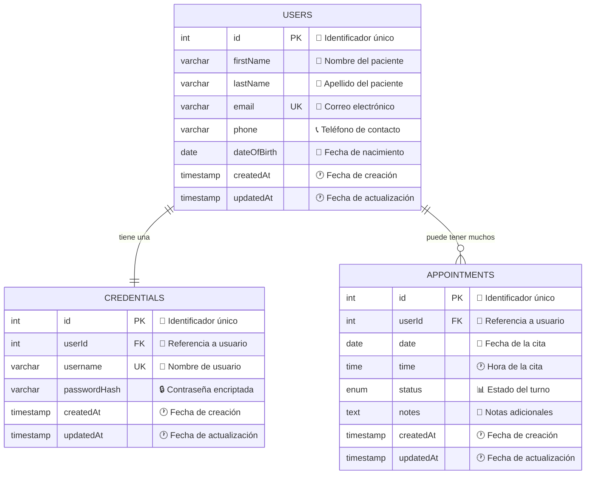

# Diagrama Entidad-Relación (ER) - Mermaid

```mermaid
erDiagram
    USERS {
        int id PK "🔑 Identificador único"
        varchar firstName "📝 Nombre del paciente"
        varchar lastName "📝 Apellido del paciente"
        varchar email UK "📧 Correo electrónico"
        varchar phone "📞 Teléfono de contacto"
        date dateOfBirth "📅 Fecha de nacimiento"
        timestamp createdAt "🕐 Fecha de creación"
        timestamp updatedAt "🕐 Fecha de actualización"
    }

    CREDENTIALS {
        int id PK "🔑 Identificador único"
        int userId FK "🔗 Referencia a usuario"
        varchar username UK "👤 Nombre de usuario"
        varchar passwordHash "🔒 Contraseña encriptada"
        timestamp createdAt "🕐 Fecha de creación"
        timestamp updatedAt "🕐 Fecha de actualización"
    }

    APPOINTMENTS {
        int id PK "🔑 Identificador único"
        int userId FK "🔗 Referencia a usuario"
        date date "📅 Fecha de la cita"
        time time "🕐 Hora de la cita"
        enum status "📊 Estado del turno"
        text notes "📝 Notas adicionales"
        timestamp createdAt "🕐 Fecha de creación"
        timestamp updatedAt "🕐 Fecha de actualización"
    }

    USERS ||--|| CREDENTIALS : "tiene una"
    USERS ||--o{ APPOINTMENTS : "puede tener muchos"
```
