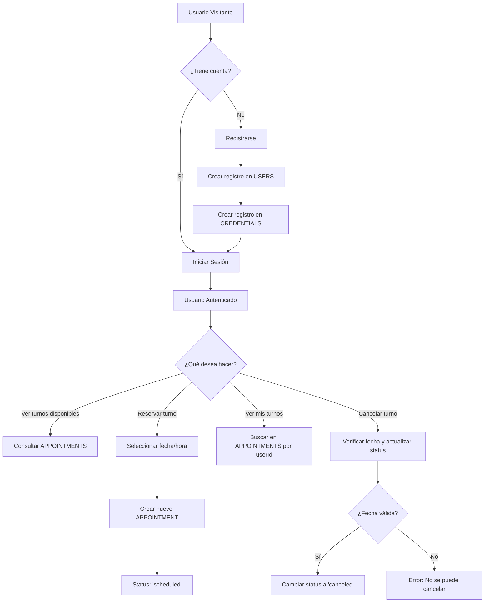

# Diagrama de Flujo del Sistema (Mermaid)

```mermaid
flowchart TD
    A[Usuario Visitante] --> B{¿Tiene cuenta?}
    B -->|No| C[Registrarse]
    B -->|Sí| D[Iniciar Sesión]

    C --> E[Crear registro en USERS]
    E --> F[Crear registro en CREDENTIALS]
    F --> D

    D --> G[Usuario Autenticado]
    G --> H{¿Qué desea hacer?}

    H -->|Ver turnos disponibles| I[Consultar APPOINTMENTS]
    H -->|Reservar turno| J[Seleccionar fecha/hora]
    H -->|Ver mis turnos| K[Buscar en APPOINTMENTS por userId]
    H -->|Cancelar turno| L[Verificar fecha y actualizar status]

    J --> M[Crear nuevo APPOINTMENT]
    M --> N[Status: 'scheduled']

    L --> O{¿Fecha válida?}
    O -->|Sí| P[Cambiar status a 'canceled']
    O -->|No| Q[Error: No se puede cancelar]
```
