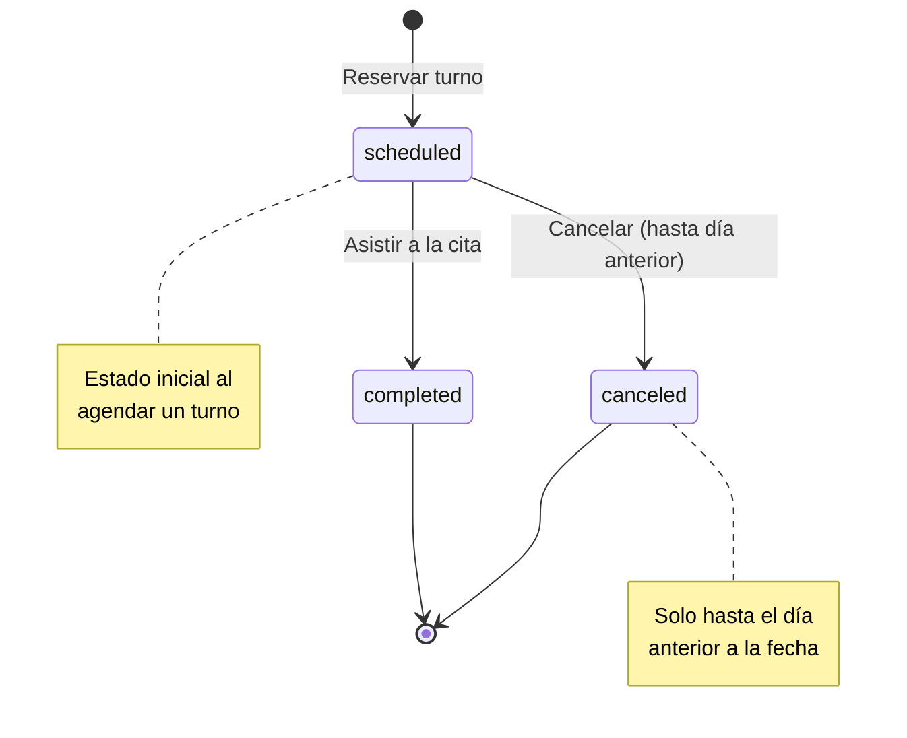

# Diagrama de Estados de Turnos (Mermaid)

```mermaid
stateDiagram-v2
    [*] --> scheduled : Reservar turno
    scheduled --> canceled : Cancelar (hasta día anterior)
    scheduled --> completed : Asistir a la cita
    canceled --> [*]
    completed --> [*]

    note right of scheduled
        Estado inicial al
        agendar un turno
    end note

    note right of canceled
        Solo hasta el día
        anterior a la fecha
    end note
```
